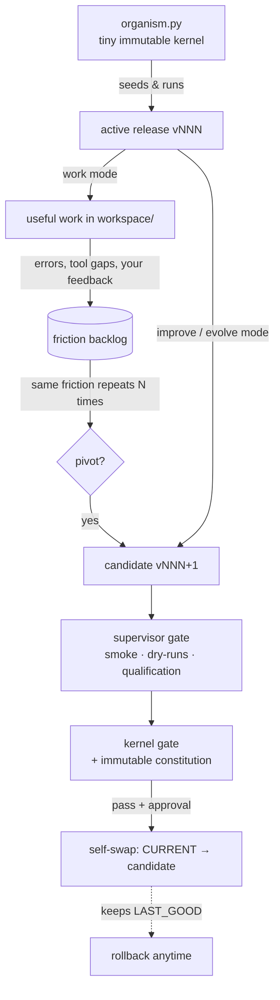

# EVA — Evolutional Agent


> [!WARNING]
> **Experimental and self-modifying.** EVA runs arbitrary shell commands and
> rewrites its own source code. **Only ever run it inside the provided Docker
> sandbox** — never directly on your host, and never against systems or data you
> care about. You are responsible for what it does with your API key and network.

> A minimal **agent seed** that boots from almost nothing and then rewrites,
> tests, and promotes **better versions of itself** — safely, inside a hardened
> Docker sandbox.

EVA starts as a tiny, non-evolving kernel plus one seed release. Give it an API
key and a task, and it does two things at once:

- **Work** — does useful work for you with shell + file + network tools.
- **Evolve** — when it hits friction, it builds a *candidate* version of its own
  code, proves the candidate is safer/better through layered gates, and — with
  your approval (or fully autonomously in the sandbox) — **swaps itself** for it.

The whole point is that *the thing being improved and the thing doing the
improving are the same organism* — but every change is a gated, reversible,
test-ratcheted step, never live surgery on a running system.

---

## Seeing is believing

This isn't a thought experiment — here is a real, unedited run on `gpt-5.5`:

| Gen | How | What EVA changed to itself |
|----|-----|----------------------------|
| **v001** | seed | The minimal organism it starts from. |
| **v002** | `improve` (human-approved) | Its own LLM output once contained invalid JSON → it logged that friction, then **hardened its JSON parser** to recover protocol objects from fenced/prose wrappers **and added a behavioral regression test** for it. |
| **v003** | `evolve --yes` (fully autonomous) | Found a **subtle bug in its own v002 fix** (it could grab an incidental `{"note": ...}` before the real action object), corrected it, strengthened the test — and **self-recovered from a real shell error mid-run**. Auto-promoted after passing all gates. |

Friction from real use → a targeted fix → a test that locks it in → gated,
rollback-protected promotion. Each generation refined the last.

---

## How it works



- **`organism.py`** is the only fixed part — a tiny kernel that seeds the first
  release, runs the active one, enforces a final gate, and can roll back. It is
  baked into the image and **never** mounted, so the agent cannot modify it.
- **Releases** (`runtime/releases/vNNN/`) are the *evolving* organism: a complete
  bundle of `supervisor.py`, `agent.py`, `tests.py`, and `manifest.json`. EVA
  evolves these as whole versioned units.
- A new version goes live only after passing the **supervisor gate** *and* the
  **kernel gate**, then human approval (auto-approved only in autonomous mode).
- `CURRENT` and `LAST_GOOD` pointers make every promotion **reversible**.

## Why it's safe to run

EVA can run arbitrary shell commands, rewrite its own source, and promote new
versions of itself — so it runs inside a hardened container
([`docker-compose.yml`](docker-compose.yml)):

- non-root user, `cap_drop: ALL`, `no-new-privileges`
- **read-only root filesystem**; only `./data/{runtime,state,workspace}` are writable
- CPU, memory and PID limits (contains runaways / fork bombs)
- the kernel is baked into the image and not mounted — the agent can't touch it
- secrets come from `.env` at runtime and are never baked into the image

On top of the sandbox, three software guarantees constrain evolution itself:

1. **Rollback** — `LAST_GOOD` + `rollback` always provide a way back.
2. **The ratchet** — a fix must add/strengthen a test; gates may only get
   *stricter*, never looser (enforced in the supervisor gate).
3. **A constitution in the immutable kernel** — `kernel_gate` independently
   verifies that a candidate keeps EVA's core identity (a friction memory and a
   self-improvement path). These checks live where the agent *can't* edit them.

> **Residual risk:** the container has outbound network access (needed for the
> LLM API and useful for research tasks), so a misbehaving agent could in
> principle exfiltrate workspace data. For maximum isolation, point EVA at a
> local model (see below) and restrict egress.

## How EVA improves itself

Every work session feeds a persistent **friction backlog**
(`data/state/backlog.jsonl`): failed shell commands, unknown/missing actions,
LLM/protocol errors, crashes, and problems EVA flags itself (`note_problem`) —
plus your thumbs-up/down at the end of a session. The backlog is the
**fitness signal**: usefulness is *grown from real failures*, not designed up front.

When the same friction recurs (default 3×, `ORGANISM_PIVOT_THRESHOLD`), EVA asks:

```
Repeated friction: 'shell:python:exit=1' seen 3x.
Pause work and pivot to an improve cycle to fix this? [y/N]
```

On `y` it cleanly switches to an `improve` cycle aimed at that root cause —
a *phase change*, not live self-modification.

## Quickstart

**Prerequisites:** Docker Desktop (Linux engine).

```powershell
# 1. configure your model
Copy-Item .env.example .env      # then set LLM_API_KEY (and LLM_MODEL)

# 2. build the sandbox image
.\run.ps1 build

# 3. try it
.\run.ps1 review                 # read-only: EVA inspects & explains itself
.\run.ps1 work "research today's weather for Berlin"
.\run.ps1 improve                # evolve a candidate (asks before each change)
.\run.ps1 status                 # show active / last-good release
.\run.ps1 rollback               # revert to the last good release
```

On Linux/macOS use `./run.sh` with the same commands.

### Modes

| Command | What it does |
|---|---|
| `work [task]` | Useful work in `workspace/` (the default purpose). |
| `review [task]` | Read-only inspection — no writes, no evolution. |
| `improve [task]` | Build a candidate release; ask before each change. |
| `evolve [N] [flags]` | Run N autonomous evolution rounds. |
| `status` / `rollback` | Show pointers / revert to `LAST_GOOD`. |

Run fully hands-off (safe **only** because Docker contains it):

```powershell
.\run.ps1 evolve 3 --yes --allow-shell
```

### Model providers

EVA bootstraps via the OpenAI **Responses API** (`/v1/responses`) by default.
The provider layer is endpoint-detected, so any `/v1/chat/completions` endpoint
(Azure OpenAI, Ollama, LM Studio, vLLM, OpenRouter, ...) also works unchanged —
and the layer is freely evolvable. For a fully local, offline-capable setup:

```dotenv
LLM_ENDPOINT=http://host.docker.internal:11434/v1/chat/completions
LLM_MODEL=llama3.1
LLM_API_KEY=ollama
```

## Inspecting & resetting

Everything EVA does is persisted on the host under `./data/` (git-ignored):

- `data/workspace/` — the work product
- `data/runtime/releases/` — every release & candidate (its evolved source) + `CURRENT` / `LAST_GOOD`
- `data/state/` — JSONL logs of agent actions, supervisor and kernel decisions, and the friction backlog

Delete `data/` to wipe all evolution and start fresh — `status` re-seeds `v001`.
The seed in `organism.py` is unchanged by evolution; new generations live only in
`data/`.

## Design philosophy

- **Minimal seed, emergent capability.** The kernel is intentionally tiny.
  Capabilities EVA needs should *emerge* from friction, not be designed in.
- **Coupled, but phase-separated.** EVA changes EVA (no decoupled "builder"
  capping its growth), yet changes take effect only as validated, reversible,
  atomic swaps.
- **Fitness from friction.** The selection pressure for "useful" comes from real
  usage — failures, tool gaps, and your feedback — captured persistently.
- **Invariants live in the immutable part.** A self-modifying system's
  constitution must sit where the system can't rewrite it.

## Honest limitations

This is an experimental research project, not production software.

- The qualification gates check structure/behavior, but don't yet exercise full
  live LLM/tool flows.
- The ratchet counts test functions; it can't see a test *body* being weakened.
- Rollback is single-level (`LAST_GOOD`), not a full history stack.
- Network egress is open by default (see residual risk above).

## Repository layout

```
organism.py          the tiny immutable kernel (carries the v001 seed)
Dockerfile           hardened, non-root, stdlib-only image
docker-compose.yml   the sandbox: read-only fs, caps dropped, resource limits
run.ps1 / run.sh     convenience wrappers
.env.example         model configuration template
data/                created at runtime; all evolution lives here (git-ignored)
```

## License

[MIT](LICENSE). Have fun, be careful, and don't run it outside the sandbox.
