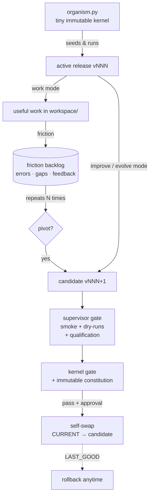

# EVA — Evolutional Agent


> [!WARNING]
> **Experimental and self-modifying.** EVA runs arbitrary shell commands and
> rewrites its own source code. **Only ever run it inside the provided Docker
> sandbox** — never directly on your host, and never against systems or data you
> care about. You are responsible for what it does with your API key and network.

> A small, **architecture-agnostic micro agentic runtime** — a learning
> playground for self-improving agents. It boots from almost nothing, then
> rewrites, tests, and promotes **better versions of itself**, inside a hardened
> Docker sandbox that contains the damage rather than preventing it.

EVA starts as a tiny, non-evolving kernel plus one seed release. Give it an API
key and run it in one of three modes:

- **`work`** — does useful work for you in `workspace/` with shell + file +
  network tools. It can *report* on itself, but never rewrites its own code.
- **`improve`** — **directed** self-change: you hand it a concrete task and it
  builds a *candidate* version of its own code that implements **exactly that**.
- **`evolve`** — **autonomous** self-change: EVA chooses the improvement itself,
  typically fixing the friction it has hit most often.

Self-modification is locked to `improve` and `evolve`; `work` can never touch the
release. Both produce a *candidate* that must clear layered gates before — with
your approval (or fully autonomously in the sandbox) — EVA **swaps itself** for it.

The whole point is that *the thing being improved and the thing doing the
improving are the same organism* — but every change is a gated, reversible,
test-ratcheted step, never live surgery on a running system.

It stays small and provider-agnostic — EVA reads its own code with plain shell
(`grep`/`sed`), talks to any OpenAI-compatible endpoint through one tiny text
protocol, and keeps a budgeted, resumable session.

## Why a seed, not a framework?

Most agent stacks are **large and human-assembled**: a rich toolbox, a curated
prompt library, an orchestration layer — designed up front by people and then
extended by people. A full-featured harness like **OpenClaw** sits at the
polished, batteries-included end of that spectrum: powerful and highly
extensible.

EVA is the opposite bet, and it is unapologetically a **research experiment,
built from scratch**:

- **Micro, not mega.** The whole runtime — the agent loop, the tools, the safety
  scaffolding — is a handful of small files you can read in one sitting. Almost
  nothing is baked in.
- **Grown, not assembled.** Capabilities aren't pre-installed; they **emerge**
  when the agent hits real friction and evolves a fix — added the moment a real
  failure demands it, not planned up front.
- **An organism, not an app.** `organism.py` is the immutable **DNA**; each
  release is a **phenotype** that may mutate; the gates are **natural selection**
  (only provably-not-worse versions survive); the friction backlog is the
  **environment** applying pressure; rollback keeps every mutation reversible.

The question EVA explores is small and a little wild: *how little do you have to
hand-write before an agent can start writing — and improving — itself?*

> This is a lab for that question, not a product. Expect rough edges, prize the
> transparency over polish, and keep it in the sandbox.

**Where it could lead.** Because EVA grows from *your* friction and *your*
feedback, it can in principle evolve toward a personal-assistant architecture
shaped to one person — you — instead of the average user. Large, established
assistants optimize for everyone and tend to skip exactly that: deep, individual
fit. The wager is that a seed which adapts to its user may end up fitting better
than a product shipped finished.

## How it works



- **`organism.py`** is the only fixed part — a tiny kernel that seeds the first
  release, runs the active one, enforces a final gate, and can roll back. It is
  baked into the image and **never** mounted, so the agent cannot modify it.
- **Releases** (`runtime/releases/vNNN/`) are the *evolving* organism: a complete
  bundle of `supervisor.py`, `agent.py`, `tests.py`, and `manifest.json`. EVA
  evolves these as whole versioned units.
- A new version goes live only after passing the **supervisor gate** *and* the
  **kernel gate**, then human approval (auto-approved only in autonomous mode).
- `CURRENT` and `LAST_GOOD` pointers make every promotion **reversible**.

## Why it's contained (not "safe")

Containment limits the *blast radius* — it does not make EVA trustworthy. Assume
a run can do anything a shell can do, then keep that box small. EVA runs inside a
hardened container ([`docker-compose.yml`](docker-compose.yml)):

- non-root user, `cap_drop: ALL`, `no-new-privileges`
- **read-only root filesystem**; only `./data/{runtime,state,workspace}` are writable
- CPU, memory and PID limits (contains runaways / fork bombs)
- the kernel is baked into the image and not mounted — the agent can't touch it
- secrets come from `.env` at runtime and are never baked into the image

On top of the sandbox, three software guarantees constrain evolution itself:

1. **Rollback** — `LAST_GOOD` + `rollback` always provide a way back.
2. **The ratchet** — a fix must add/strengthen a test; gates may only get
   *stricter*, never looser (enforced in the supervisor gate).
3. **A constitution in the immutable kernel** — `kernel_gate` independently
   verifies that a candidate keeps EVA's core identity (a friction memory and a
   self-improvement path). These checks live where the agent *can't* edit them.

> **Residual risk:** the container has outbound network access (needed for the
> LLM API and useful for research tasks), so a misbehaving agent could in
> principle exfiltrate workspace data. For maximum isolation, point EVA at a
> local model (see below) and restrict egress.

## How EVA improves itself

Every work session feeds a persistent **friction backlog**
(`data/state/backlog.jsonl`): failed shell commands, unknown/missing actions,
LLM/protocol errors, crashes, and problems EVA flags itself (`note_problem`) —
plus your thumbs-up/down at the end of a session. The backlog is the
**fitness signal**: usefulness is *grown from real failures*, not designed up front.

When the same friction recurs (default 3×, `ORGANISM_PIVOT_THRESHOLD`), EVA asks:

```
Repeated friction: 'shell:python:exit=1' seen 3x.
Pause work and pivot to an improve cycle to fix this? [y/N]
```

On `y` it cleanly switches to an `improve` cycle aimed at that root cause —
a *phase change*, not live self-modification.

## Quickstart

**Prerequisites:** Docker Desktop (Linux engine).

```powershell
# 1. configure your model
Copy-Item .env.example .env      # then set LLM_API_KEY (and LLM_MODEL)

# 2. build the sandbox image
.\run.ps1 build

# 3. try it
.\run.ps1 review                 # read-only: EVA inspects & explains itself
.\run.ps1 work "research today's weather for Berlin"
.\run.ps1 work resume            # continue an interrupted session
.\run.ps1 improve "add a CHANGELOG and report it in work mode"   # directed self-change
.\run.ps1 status                 # show active / last-good release
.\run.ps1 rollback               # revert to the last good release
```

On Linux/macOS use `./run.sh` with the same commands.

### Modes

| Command | What it does |
|---|---|
| `work [task]` | Useful work in `workspace/` (the default purpose). |
| `review [task]` | Read-only inspection — no writes, no evolution. |
| `improve [task]` | **Directed** self-change — builds a gated candidate that implements *your* task (asks before each change). |
| `evolve [N] [flags]` | **Autonomous** self-change — EVA picks the improvement itself and runs N rounds. |
| `work resume` / `improve resume` | Continue an interrupted session — the conversation is persisted to disk after every step and survives a restart. |
| `status` / `rollback` | Show pointers / revert to `LAST_GOOD`. |

`work`, `improve`, and `review` run as an **interactive chat** — after each turn
you can type a follow-up; press Enter on an empty line (or type `exit`) to end.

Run fully hands-off (tolerable **only** because Docker contains it):

```powershell
.\run.ps1 evolve 3 --yes --allow-shell
```

### Model providers

Set the endpoint, model, and key in `.env`. Currently OpenAI-compatible models are supported (improve EVA to support more).

## Inspecting & resetting

Everything EVA does is persisted on the host under `./data/` (git-ignored):

- `data/workspace/` — the work product
- `data/runtime/releases/` — every release & candidate (its evolved source) + `CURRENT` / `LAST_GOOD`
- `data/state/` — JSONL logs of agent actions, supervisor and kernel decisions, and the friction backlog

Delete `data/` to wipe all evolution and start fresh — `status` re-seeds `v001`.
The seed in `organism.py` is unchanged by evolution; new generations live only in
`data/`.

## Honest limitations

This is an experimental research project, not production software.

- The qualification gates check structure/behavior, but don't yet exercise full
  live LLM/tool flows.
- The ratchet counts test functions; it can't see a test *body* being weakened.
- Rollback is single-level (`LAST_GOOD`), not a full history stack.
- Context summarization is deterministic and rudimentary, and only one session is
  kept at a time.
- Network egress is open by default (see residual risk above).

## Repository layout

```
organism.py          the tiny immutable kernel (carries the v001 seed)
Dockerfile           hardened, non-root, stdlib-only image
docker-compose.yml   the sandbox: read-only fs, caps dropped, resource limits
run.ps1 / run.sh     convenience wrappers
.env.example         model configuration template
data/                created at runtime; all evolution lives here (git-ignored)
```

## License

[MIT](LICENSE). Have fun, be careful, and don't run it outside the sandbox.
