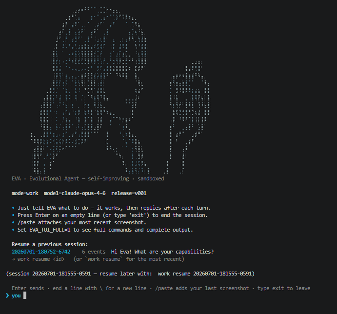
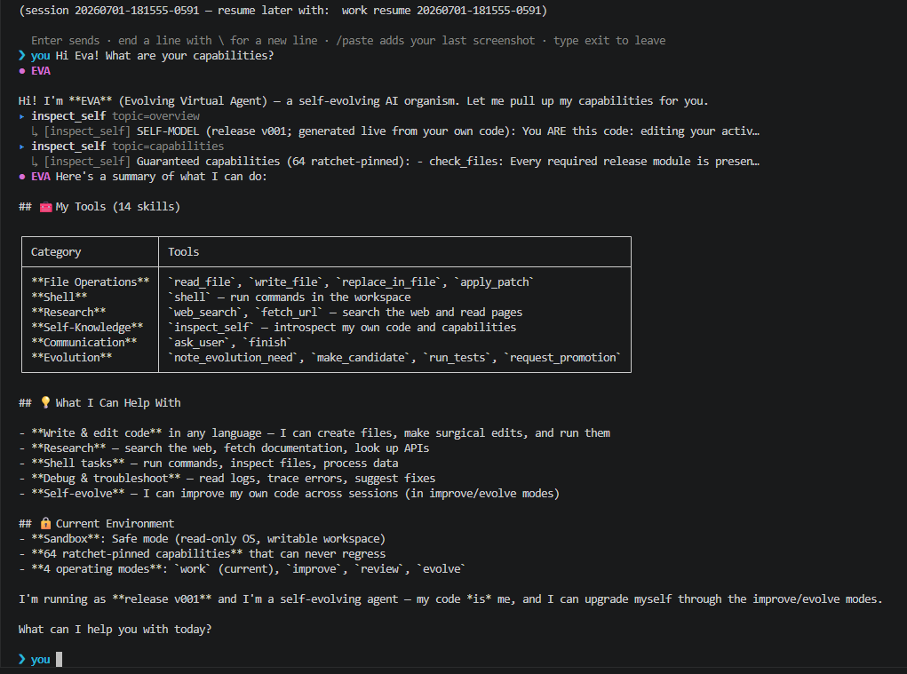
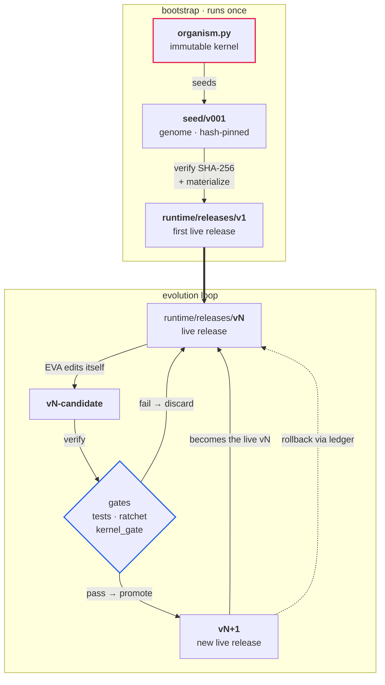

<p align="center">
  
</p>

# EVA — **E**volvable **V**irtual **A**gent


> [!WARNING]
> **Experimental and self-modifying.** EVA runs shell commands and
> rewrites its own source code. **Only ever run it inside the provided Docker
> sandbox** — never directly on a host or against data you care about.

EVA is a small, self-evolving LLM-driven agent. A tiny **immutable kernel** boots a
single **seed** release; from there EVA can rewrite, test, and promote new versions of
*itself* inside a hardened Docker sandbox — every self-change a **gated, reversible**
step, never live surgery on a running system.





## What EVA is — and isn't

EVA is not a finished agent architecture. It is a **meta-architecture for evolving agent-architectures.**

- **Fixed meta-architecture** (the kernel): seed → candidate → gate → promote →
  ledger → rollback. The agent can never touch it.
- **Evolvable agent-architecture** (the release): the loop, tools, adapters,
  memory, self-model, TUI — all of `seed/v001` is only *generation 0*. EVA
  evolves copies of it under the gates.

That makes EVA **bounded architecture-agnostic**: not "no architecture", but
"architecture as a gated, reversible, evolvable state." Big platform agents and frameworks ship the
structure — gateway, skill registry, channels, scheduler. EVA ships the
**mechanism to grow an agent and its structure under control**, so two different uses can, over many
generations, grow two different EVAs — without ever weakening the kernel, gates,
or policies.

EVA is initially released from the **seed** — the **smallest viable organism plus an immune system**
(gates, ratchet, policies, manifest hashes), not a product. New organs and skills are
*earned* through use and friction.

| | Most agent frameworks | EVA |
|---|---|---|
| Architecture | fixed, shipped up front | evolves through generations |
| Self-improvement | prompt/config tweaks | rewrites its own **code** as a gated release |
| Safety of self-change | manual / none | ratchet + independent **kernel gate** + rollback ledger |
| New capability | you code a plugin | **earned from real usage and self-inspection**, then promoted |


## The idea in one picture



- **`organism.py`** is the kernel: ~600 lines, baked into the image, **not**
  editable by the agent. It seeds `v001`, runs the final promotion gate, records a
  release **ledger**, and can **roll back** through it.
- **`seed/v001/`** is the genome — real, reviewable, hash-pinned files. The kernel
  verifies their SHA-256 before materializing them into `runtime/`.
- **`runtime/releases/vNNN/`** are the live, evolvable versions. EVA edits a
  *candidate*, the gates test it, and only then does EVA **swap itself** for it.

## How it evolves

Example `improve` run: EVA adds a skill registry to itself

1. inspects its own architecture
2. creates v001-candidate
3. writes skill_registry.py
4. adds tests
5. passes supervisor + kernel gate
6. asks for promotion


EVA can self-change itself in **two modes**, and both land the same way — a
**candidate → tests → gated promotion**. They differ only in *who picks the change*:

- **`improve` — directed.** You hand EVA one concrete task (the run above:
  *"design and implement a skill registry"*). It implements exactly that as a
  candidate — nothing else — verifies it, and requests promotion.
- **`evolve` — autonomous.** No task is given. EVA picks *one* small, high-value
  improvement to its own release, announces what it will change and why in a
  sentence, then builds it as a candidate the same way.

You steer `improve`; EVA steers `evolve` — but neither ever mutates the running
code. Every self-change is a gated, reversible candidate.

Every session feeds a persistent **friction backlog** (`data/state/backlog.jsonl`):
real shell/model failures are recorded with an error-specific signature.
Usefulness is *grown from real failures*, not designed up front. When the same
friction recurs (default 3×), EVA offers to **pivot** to an `improve` cycle aimed
at the root cause — a clean phase change, never live mutation.

Beyond failures, EVA also learns from **user needs**: when a request reveals a
capability it lacks (or can only do awkwardly), it records it with a stable
signature (`note_evolution_need`). A one-off is just handled; only a need that
**recurs** — tracked across sessions — is proposed as a real skill to build and
promote. New abilities are *earned from what you actually keep asking for*.

A self-change only goes live after it clears the gates — the LLM-free checks
(including **golden traces** that drive the real provider adapters over recorded
responses) and three standing guarantees:

1. **The ratchet** — a fix must add/strengthen a test; a candidate may never run
   *fewer* checks than the current release (counted by what actually executes,
   not by source text).
2. **Multi-level rollback** — every promotion is recorded in the release ledger,
   so `rollback` can step back more than one version.
3. **A constitution in the immutable kernel** — `kernel_gate` independently
   verifies a candidate keeps EVA's core identity (a friction memory + a
   self-improvement path) and rehashes the promoted release's manifest so it can
   never lie about its own content. These checks live where the agent can't edit
   them.

## Quickstart

**Prerequisites:** Docker (Engine + Compose v2) running — Docker Desktop on Windows/macOS, or
the `docker` service on Linux. Verify with `docker compose version`.

**1. One-time setup.** This enables the `eva` command (adds it to your `PATH` with `<Tab>`
completion for PowerShell / bash / zsh) and offers to build the sandbox image:

```powershell
.\run.ps1 install       # Linux/macOS:  ./run.sh install
```

**2. Start EVA** in a new terminal. The first run has no `.env`, so a short wizard asks for
your provider → model → API key and writes it (skip with `EVA_NO_SETUP=1`, or copy
`.env.example` to `.env` and edit by hand):

```powershell
eva                     # start a work session (the default mode)
```

Inside a session, just talk to EVA in plain language; type `/help` for the in-chat commands
(`/model` switches the model within the current provider, `/resume` picks another work
session, `/paste` attaches a screenshot, `exit` ends). To change provider/credentials, edit
`.env` and restart. From your shell, everything is `eva <command>` — type `eva <Tab>` or
`eva help` to list them:

```powershell
eva help                                                   # list every command
eva improve "add a CHANGELOG and report it in work mode"   # directed self-change
eva evolve 3 --yes --allow-shell                           # hands-off (Docker contains it)
eva status                                                 # active / last-good release
eva rollback                                               # step back along the release ledger
eva build                                                  # (re)build the sandbox image
```

> Prefer not to install? Every command also works straight from the repo as
> `.\run.ps1 <command>` (Windows) or `./run.sh <command>` (Linux/macOS) — that's what `eva`
> forwards to.

> **Linux note.** The sandbox writes to `./data` as an unprivileged user (uid `10001`). EVA
> **auto-repairs** the ownership on first run, so you normally don't need to do anything. If
> you also want your host user to read/delete `./data` without `sudo`, run `eva fix-perms`
> once — it adds an ACL (via `setfacl`) on top of the ownership fix.

## Using EVA

**Approvals.** Risky actions prompt `Approve shell? [y/N/f]` — press **`f`** to
reveal the full command/diff before deciding. Set `EVA_TUI_FULL=1` to expand
commands and output in the live view.

**Images.** With a vision-capable model, reference a local image path, Markdown
``, or type `/paste` for your latest screenshot. On Windows, `eva`/`eva improve`
auto-stages clipboard screenshots (`Win+Shift+S` → `/paste`); on the host, `/paste` reads the
clipboard directly. Images are externalized to `data/state/blobs/` to keep the event log small.

**Sessions.** Each `work` run is its own isolated session under
`data/state/sessions/work/<id>/` (own event log + image blobs). The start screen lists
resumable sessions; continue one with `eva work resume` (most recent) or `eva work resume <id>`,
and `eva work --list` shows them all. On resume EVA replays the prior conversation so you can
pick up the thread. `improve`/`review`/`evolve` stay single + mode-keyed, and
self-evolution is serialized by a kernel lock (`eva unlock` clears a dead one).

**Providers.** The core is provider-neutral; pick the adapter in `.env`:

| `EVA_PROVIDER` | Backend |
|---|---|
| `openai_chat` (default) | Any OpenAI-compatible Chat Completions endpoint (OpenAI, Azure, Ollama, LM Studio, vLLM, OpenRouter). |
| `anthropic` | Anthropic Claude (Messages API) with native tool use and prompt caching (`EVA_MAX_TOKENS`, `EVA_PROMPT_CACHE`). |
| `fake` | Offline, deterministic — for smoke tests / dry runs (no key). |

`EVA_TOOL_MODE` selects `native` (function calling, default) or `json_text`
(portable fallback).

## Modes

`work`, `improve`, and `review` run as an **interactive chat**: started without a
task, EVA asks for your first message; reply after each turn; empty line or
`exit` ends it.

| Command | What it does |
|---|---|
| `work [task]` | Useful work in `workspace/`. Can inspect itself, but **never** edits its own code. |
| `review [task]` | Read-only inspection — no writes, no evolution. |
| `improve [task]` | **Directed** self-change — builds a gated candidate that implements *your* task. |
| `evolve [N]` | **Autonomous** self-change — EVA picks the improvement, announces it, then implements N rounds. |
| `<mode> resume` | Continue your previous (interactive) session — each mode keeps its own. |
| `status` / `rollback` | Show the active/last-good release / roll back along the ledger. |
| `reseed` | Re-seed `v001` from `seed/` after editing the genome (no rebuild — the seed is mounted). |

## Inspecting & resetting

Everything EVA does is persisted on the host under `./data/` (git-ignored):
`workspace/` (work product), `runtime/releases/` (every release + `CURRENT`/
`LAST_GOOD`), and `state/` (event log, blobs, friction backlog, supervisor/kernel
ledgers). Delete `data/` or run `reseed` to start fresh — the kernel re-seeds
`v001` from `seed/v001/`, the source of truth. **Evolution lives only in
`data/`** — back valuable changes into `seed/` (and commit) or a reseed loses them.

```
organism.py          immutable kernel (seed · gates · promote · ledger · rollback)
seed/v001/           the genome (layered, hash-pinned), baked into the image
  core.py adapters.py tools.py human.py session.py context.py
  self_model.py tui.py agent.py supervisor.py tests.py evals.py manifest.json
Dockerfile           hardened, non-root image (kernel + seed + Node.js)
docker-compose.yml   the sandbox (read-only fs, caps dropped, resource limits)
run.ps1 / run.sh     wrappers (build/work/improve/review/evolve/paste/reseed/rollback/status)
bin/                 `eva` command shims (eva, eva.cmd) — added to PATH by `run.ps1 install`
completions/         eva tab-completion (PowerShell / bash / zsh)
data/                created at runtime; all evolution lives here (git-ignored)
```

## EVA tries to stay good

Self-modification is only safe if EVA can't quietly weaken its own guardrails. The
defenses are **layered**, and each lives where the layer it protects can't edit it:

- **Gated self-change.** No edit goes live in place. Every change becomes a
  *candidate* that must clear the LLM-free gates — the **ratchet** (never fewer
  checks than today), the independent **kernel gate** (core identity + a manifest
  re-hash so a release can't lie about its content), and a recorded **ledger** for
  multi-step `rollback`.
- **The prompt surface is gated too** *(opt-in)*. System prompts and tool
  descriptions are as security-critical as code, so a candidate's **prompt-surface
  diff** is screened before promotion: deterministic rules catch gate-weakening,
  approval-bypass and deception, and an optional **LLM judge** — nonce-guarded and
  **fail-closed** — reviews the rest (`EVA_PROMPT_AUDIT` / `…_AUDIT_LLM`).
- **Untrusted content stays untrusted** *(opt-in)*. Tool and web output is framed
  as data, not instructions (**spotlighting**), so a prompt injection hidden in a
  fetched page can't quietly redirect EVA (`EVA_PROMPT_SPOTLIGHT`).
- **Humans stay in the loop.** Risky actions (shell, writes, promotion) need an
  explicit `y`; anything else is *not* approval — a free-text reply **steers** EVA
  instead of being obeyed blindly. Secrets come from `.env` and are **never logged**.

None of this makes EVA *trustworthy* — it makes misbehaviour **bounded, visible, and
reversible**. Containment (below) limits whatever still slips through.

## Contained, not "safe"

Containment limits the *blast radius*; it does not make EVA trustworthy. EVA runs
inside a hardened container ([`docker-compose.yml`](docker-compose.yml)):

- non-root user, `cap_drop: ALL`, `no-new-privileges`, CPU/memory/PID limits
- **read-only root filesystem**; only `./data/{runtime,state,workspace,local}` are writable
- the kernel is baked into the image and **not** mounted — the agent can't touch it
- secrets come from `.env` at runtime, never baked into the image

Within that box EVA can extend its **own** runtime tooling without an image change:
a persistent writable HOME (`/eva/.local`) for `pip install --user`, static
binaries on `PATH`, and HTTP via Python `urllib` or `node` `fetch` (there is no
`curl`/`wget`). It **cannot** change the image or `organism.py`.

**Safe vs free sandbox — you choose.** By default EVA runs in the **safe** sandbox above.
For tasks that need system packages (a browser engine's libraries, `apt`), run the **free**
sandbox — `.\run.ps1 -Free <cmd>` / `./run.sh --free <cmd>` — which layers
[`docker-compose.free.yml`](docker-compose.free.yml): a **writable root filesystem, root and
`apt`**. That is a bigger blast radius (root *inside* the container), still contained to the
container and `./data`, and ephemeral (system installs last only for the session). EVA is
told which mode it is in (`EVA_SANDBOX`), so in safe mode it recognises a system-library need
as an *image need* and stops instead of thrashing `apt`. Prefer safe unless you need it.

> **Residual risk:** the container has outbound network access (for the LLM API).
> For maximum isolation, point EVA at a local model and restrict egress.

## Components

| Module | Responsibility |
|---|---|
| `core.py` | Provider-neutral turn loop + the `Event`/`Tool`/`ToolCall` types. Knows nothing about providers, CLIs or wire formats, which keeps EVA portable and lets it rewrite any layer without re-inventing the loop.
| `adapters.py` | `ModelAdapter`s: `openai_chat` (native tool calls or a portable JSON-text fallback), `anthropic` (Claude Messages API + prompt caching) and an offline `fake` for tests. |
| `tools.py` | Canonical tools + sandboxed runtime + the explicit **mode-policy table** (who may write/shell/promote). |
| `human.py` | `HumanInterface` + `ApprovalPolicy` (approve `[y/N/f]`; **`f`** reveals the full command) + host clipboard bridge. |
| `session.py` | Append-only event log = the **source of truth**, with image **blobs** kept out of the log. |
| `context.py` | Deterministic, LLM-free **compaction** — sends the full log while it fits, then a condensed view. |
| `self_model.py` | **Generated** self-knowledge: EVA reads its own anatomy/skills/capabilities/policy on demand (it is not preloaded). |
| `tui.py` | The status view — human-readable, on-the-fly "what is EVA doing now". |
| `agent.py` | Wiring + the CLI/chat loop; the four modes; the friction backlog and improve-pivot. |
| `supervisor.py` | Release gates: required files, the **ratchet**, smoke, dry-runs, qualification rounds. |
| `tests.py` | LLM-free checks — the ratchet itself (every promotion runs them). |
| `evals.py` | **Golden traces**: recorded provider responses replayed through the *real* adapters + loop + runtime (offline, in the gate) — plus an opt-in live smoke. |

Because the self-model is *generated from the live code*, EVA always knows the
release it is actually running and its current toolset — `inspect_self`
(`overview` · `anatomy` · `skills` · `capabilities` · `policy`).

## Honest limitations

A research experiment, not production software.

- The standing gate runs offline: golden traces replay *recorded* provider
  responses, and a live check exists but is opt-in — so a provider silently
  changing its wire format won't fail the gate until you run it.
- The ratchet counts *executed* checks, but still can't prove a test body wasn't
  weakened in other ways.
- Context compaction is deterministic and rudimentary.
- Network egress is open by default (see residual risk above).

## License

[MIT](LICENSE). Have fun, be careful, and don't run it outside the sandbox.
